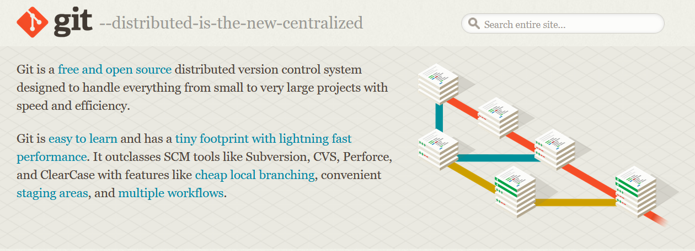

# Latihan-VCS
Repository ini dibuat untuk memenuhi tugas Bahasa Pemrograman

Nama      : Mohamad Farizal Arifin

Nim        : 312010231

Kelas      : TI.20.B.1

## Langkah-Langkah Penggunaan Git

* Download Git terlebih dahulu, dengan link berikut ini : [Click Here](https://git-scm.com/)
