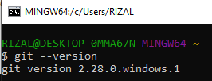

# Latihan-VCS
Repository ini dibuat untuk memenuhi tugas Bahasa Pemrograman

Nama      : Mohamad Farizal Arifin

Nim        : 312010231

Kelas      : TI.20.B.1

## Langkah-Langkah Penggunaan Git

* Download Git terlebih dahulu, dengan link berikut ini : [Click Here](https://git-scm.com/)

* Setelah file terdownload, silahkan lakukan instalasi dengan referensi berikut ini : [Git Installation Guide](https://git-scm.com/book/en/v2/Getting-Started-Installing-Git)

* Setelah proses installasi selesai, silahkan buka *software* **GitBash** pada menu di Windows, dan lakukan pengecekan versi, dengan mengetik syntax berikut :
    > git --version

    